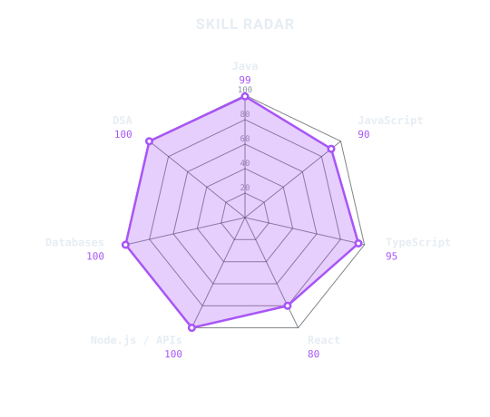
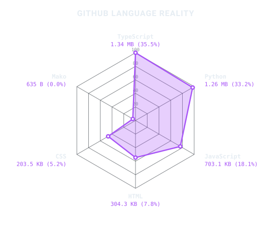

# SIDDHANT MOHAN JHA — Futuristic GitHub Profile

> **Workspace Documentation & Profile README Template**
> Primary Accent: `#A855F7` (Neon Purple) | Theme: Cyber / Developer

---

<!-- ======================================================================= -->
<!--                      GITHUB PROFILE README HEADER                       -->
<!-- ======================================================================= -->

<div align="center">

  <!-- PORTRAIT -->
  <picture>
    <source media="(prefers-color-scheme: dark)" srcset="assets/portrait-dark.png">
    <source media="(prefers-color-scheme: light)" srcset="assets/portrait-light.png">
    
  </picture>

  <br /><br />

  <!-- NAME & TITLE -->
  <h1>SIDDHANT MOHAN JHA</h1>
  <h3><code>FULL STACK DEVELOPER</code></h3>

  <br />

  <!-- TYPING BANNER -->
  

  <br /><br />

  <!-- SOCIAL BADGES -->
  <p>
    <a href="https://www.linkedin.com/in/siddhant-mohan-jha/" target="_blank">
      
    </a>
    &nbsp;
    <a href="mailto:SIDDMJ07@GMAIL.COM">
      
    </a>
    &nbsp;
    <a href="https://leetcode.com/u/sidd_cooks/" target="_blank">
      
    </a>
  </p>

  <!-- PROFILE VIEW COUNTER -->
  

</div>

<br />

---

### ⚡ 01 // WHOAMI `~/whoami`

```console
$ cat about.txt
> NAME      : SIDDHANT MOHAN JHA
> ROLE      : FULL STACK DEVELOPER
> LOCATION  : INDIA
> FOCUS     : SCALABLE WEB APPLICATIONS, BACKEND & FRONTEND ARCHITECTURE
```

#### 📌 Overview & Work Ethic
> I take ownership of what I commit to and follow it through to completion. When a task requires something I don't know yet, I learn it and keep going until it's done.

#### 🔬 Recent Project — DigiLens.OS
> Built **DigiLens.OS** — an AI-powered research and document assistant focused on financial document analysis. The system processes uploaded documents through RAG pipelines and vector database retrieval, enabling intelligent question answering over complex financial data.

<br />

### 🛠️ 02 // TECH_STACK `~/tech-stack`

#### 🧰 Core Skill Toolbox Grid
<p>
  <picture>
    <source media="(prefers-color-scheme: dark)" srcset="https://skillicons.dev/icons?i=java,js,cpp,cs,ts,react,nodejs,docker,git,github&theme=dark">
    <source media="(prefers-color-scheme: light)" srcset="https://skillicons.dev/icons?i=java,js,cpp,cs,ts,react,nodejs,docker,git,github&theme=light">
    
  </picture>
</p>

#### 💻 Programming Languages
<p>
  
  
  
  
  
</p>

#### 🌐 Frontend Frameworks & Styling
<p>
  
  
  
  
  
</p>

#### ⚙️ Backend Systems & APIs
<p>
  
  
  
</p>

#### 🗄️ Databases & Storage
<p>
  
  
  
  
</p>

#### 🛠️ Tools & Cloud Platforms
<p>
  
  
  
  
  
  
  
  
  
</p>

#### 🚀 Currently Learning & Exploring
<p>
  
  
  
  
</p>

<br />

### 📊 03 // SKILL_RADARS `~/skill-radars`

<table width="100%">
<tr>
<td width="50%" align="center">

<b>SELF-RATED SKILLS</b>

<br /><br />

<picture>
  <source media="(prefers-color-scheme: dark)" srcset="assets/radar-dark.svg">
  <source media="(prefers-color-scheme: light)" srcset="assets/radar-light.svg">
  
</picture>

</td>
<td width="50%" align="center">

<b>GITHUB LANGUAGE REALITY</b>

<br /><br />

<picture>
  <source media="(prefers-color-scheme: dark)" srcset="assets/radar-langs-dark.svg">
  <source media="(prefers-color-scheme: light)" srcset="assets/radar-langs-light.svg">
  
</picture>

</td>
</tr>
</table>

<br />

### 🔢 04 // THE_NUMBERS `~/stats`

<table width="100%">
<tr>
<td width="50%" align="center">

<b>GITHUB PROFILE STATISTICS</b>

<br /><br />

<picture>
  <source media="(prefers-color-scheme: dark)" srcset="https://github-readme-stats.vercel.app/api?username=Sidd1104&show_icons=true&theme=dark&hide_border=true&bg_color=0d1117&title_color=A855F7&icon_color=A855F7&text_color=c9d1d9">
  <source media="(prefers-color-scheme: light)" srcset="https://github-readme-stats.vercel.app/api?username=Sidd1104&show_icons=true&theme=default&hide_border=true&bg_color=ffffff&title_color=7e22ce&icon_color=7e22ce&text_color=24292e">
  
</picture>

</td>
<td width="50%" align="center">

<b>COMMIT STREAK METRICS</b>

<br /><br />

<picture>
  <source media="(prefers-color-scheme: dark)" srcset="https://github-readme-streak-stats.herokuapp.com/?user=Sidd1104&theme=dark&hide_border=true&background=0d1117&ring=A855F7&fire=A855F7&currStreakLabel=A855F7">
  <source media="(prefers-color-scheme: light)" srcset="https://github-readme-streak-stats.herokuapp.com/?user=Sidd1104&theme=default&hide_border=true&background=ffffff&ring=7e22ce&fire=7e22ce&currStreakLabel=7e22ce">
  
</picture>

</td>
</tr>
</table>

<br />

### 📈 05 // CONTRIBUTION_ACTIVITY `~/activity`

<div align="center">

  <!-- 3D ISOMETRIC CONTRIBUTION METRICS -->
  <picture>
    <source media="(prefers-color-scheme: dark)" srcset="assets/metrics-dark.svg">
    <source media="(prefers-color-scheme: light)" srcset="assets/metrics-light.svg">
    
  </picture>

  <br /><br />

  <!-- CONTRIBUTION SNAKE ANIMATION -->
  <picture>
    <source media="(prefers-color-scheme: dark)" srcset="https://raw.githubusercontent.com/Sidd1104/Sidd1104/output/snake-dark.svg">
    <source media="(prefers-color-scheme: light)" srcset="https://raw.githubusercontent.com/Sidd1104/Sidd1104/output/snake-light.svg">
    
  </picture>

</div>

<br />

### ◈ 06 // DEVELOPER_TERMINAL `~/connect`

<div align="center">

```console
┌──────────────────────────────────────────────────────────┐
│ SYSTEM // SIDDHANT MOHAN JHA                             │
├──────────────────────────────────────────────────────────┤
│ $ ./status --summary                                     │
│ ROLE     : FULL STACK DEVELOPER                          │
│ EXPLORING: RAG PIPELINES, VECTOR DATABASES, NEXT.JS       │
│ WORKFLOW : BUILD & FINISH                                │
└──────────────────────────────────────────────────────────┘
```

> **Work Ethic**: *"I take ownership of what I commit to and follow it through to completion. When a task requires something I don't know yet, I learn it and keep going until it's done."*

<br />

<h3>Let's build something meaningful.</h3>

<br />

<!-- CONTACT BADGES -->
<p>
  <a href="https://www.linkedin.com/in/siddhant-mohan-jha/" target="_blank">
    
  </a>
  &nbsp;
  <a href="mailto:SIDDMJ07@GMAIL.COM">
    
  </a>
  &nbsp;
  <a href="https://leetcode.com/u/sidd_cooks/" target="_blank">
    
  </a>
</p>

</div>
